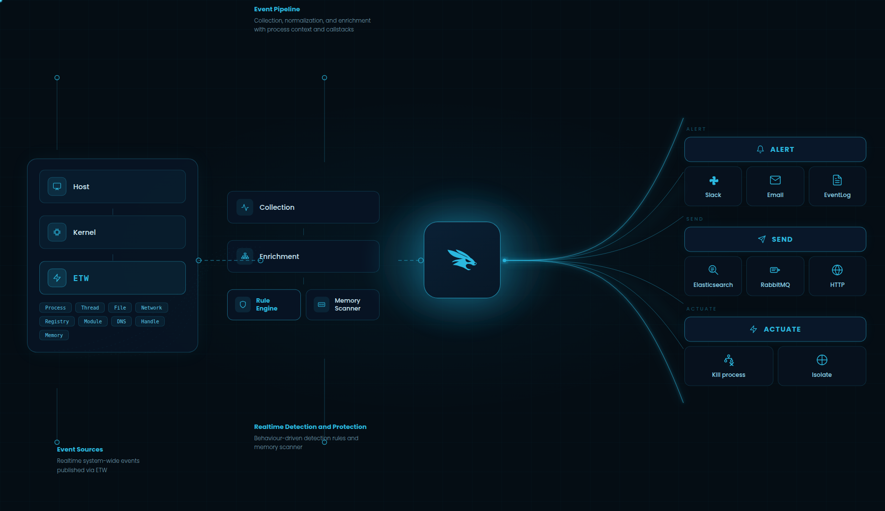

<p align="center" >
  <a href="https://fibratus.io" >
    
  </a>
</p>

<h2 align="center">Fibratus</h2>

<p align="center">
  Security sensor for realtime threat detection and protection
  <br>
  <a href="https://docs.fibratus.io/setup/installation"><strong>Get Started »</strong></a>
  <br>
  <br>
  <strong>
    <a href="https://docs.fibratus.io">Docs</a>
    &nbsp;&nbsp;&bull;&nbsp;&nbsp;
    <a href="https://fibratus.io/rules">Rules</a>
    &nbsp;&nbsp;&bull;&nbsp;&nbsp;
    <a href="https://github.com/rabbitstack/fibratus/tree/master/filaments">Filaments</a>
    &nbsp;&nbsp;&bull;&nbsp;&nbsp;
    <a href="https://fibratus.io/downloads">Download</a>
    &nbsp;&nbsp;&bull;&nbsp;&nbsp;
    <a href="https://github.com/rabbitstack/fibratus/discussions">Discussions</a>
  </strong>
</p>

Fibratus detects and eradicates advanced attacker tradecraft, malware, and emerging threats by scrutinizing and asserting a wide spectrum of [system events](https://docs.fibratus.io/telemetry/events) against a behavior-driven [rule engine](https://docs.fibratus.io/rules) and [YARA](https://docs.fibratus.io/yara) memory scanner.

Events can be routed to a wide range of [output sinks](https://docs.fibratus.io/telemetry/outputs) or written to [capture](https://docs.fibratus.io/captures) files for local inspection and forensic analysis. With [filaments](https://docs.fibratus.io/filaments), you can extend Fibratus with your own tooling and tap into the full power of the Python ecosystem.

In a nutshell, the Fibratus mantra is built on three pillars: **realtime behavior detection**, **memory scanning**, and **forensics**.

<p align="center" >
  <a href="https://fibratus.io" >
    
  </a>
</p>

### Get Fibratus Running

The fastest way to install Fibratus is to run the following command from an **elevated PowerShell** terminal:

```
irm https://install.fibratus.io | iex
```

That's it. The installer downloads and sets up the latest version of Fibratus.

Once installed, follow the [Quick Start](https://docs.fibratus.io/setup/quick-start) to see Fibratus detect your first security event in real time.

> Prefer a manual installation? See the [Installation Guide](https://docs.fibratus.io/setup/installation) for alternative installation methods and detailed instructions.

### Learn

Go beyond the quick start and [learn](https://docs.fibratus.io) how Fibratus works under the hood. Explore the fundamentals, understand how Fibratus observes system activity, and learn how to build [rules](https://fibratus.io/rules) that detect and respond to threats.

### Contribute

We love contributions. To start contributing to Fibratus, please read our [contribution guidelines](https://github.com/rabbitstack/fibratus/blob/master/CONTRIBUTING.md).

### Code Signing Policy

Free code signing provided by [SignPath.io], certificate by
[SignPath Foundation]. All releases are automatically signed.

[SignPath.io]: https://signpath.io
[SignPath Foundation]: https://signpath.org

---

<p align="center">
  Developed with ❤️ by <strong>Nedim Šabić Šabić</strong> and <strong>contributors</strong>
</p>
