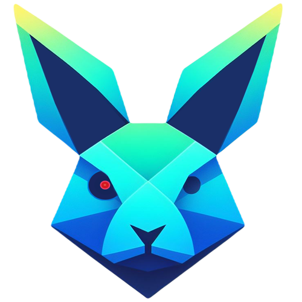

<!-- _coverpage.md -->

  </img>

# fibratus <small>2.2.1</small>

>  Adversary tradecraft detection, protection, and hunting

- <ion-icon class="fast-icon" name="flash"></ion-icon> Runtime behaviour detection
- <ion-icon class="comprehensive-icon" name="magnet"></ion-icon> Forensics capabilities
- <ion-icon class="extensible-icon" name="cube"></ion-icon> Memory scanning

<a href="https://github.com/rabbitstack/fibratus/releases" target="_blank" rel="noopener"><ion-icon name="download"></ion-icon> Download</a>
<a href="#/setup/installation"><ion-icon name="rocket"></ion-icon> Get Started</a>

  </img>

