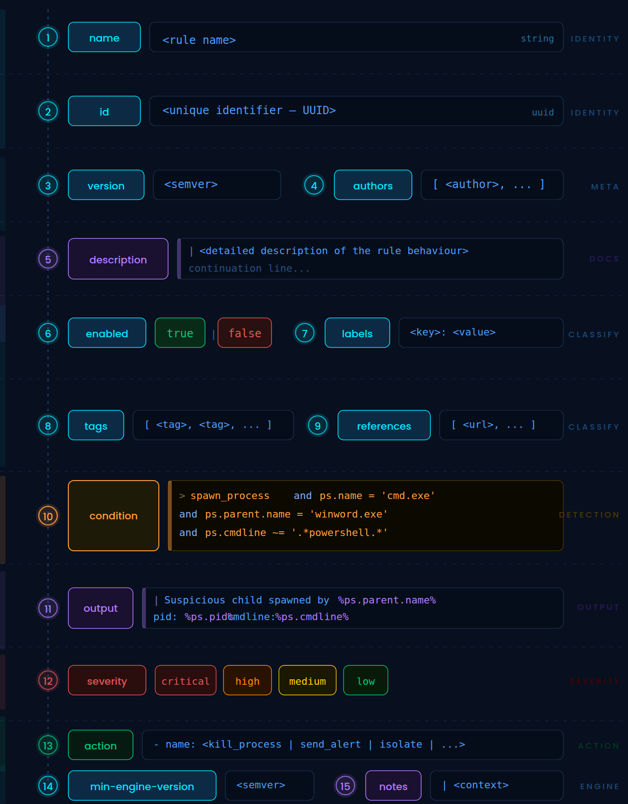

# Rules

##### Fibratus rules define how behavioral patterns are detected from system telemetry. They allow expressing conditions over events and optionally trigger [response actions](rules/actions.md). Inspired by declarative detection formats like [Sigma](https://sigmahq.io/), Fibratus rules are designed to be readable, expressive, and tightly integrated with the event model.

## Rule Structure

A rule is defined in `YAML` format and consists of **metadata**, a detection **condition**, and optional response **actions**.



The recommended rule naming nomenclature dictates that the rule file starts with the [MITRE](https://attack.mitre.org/tactics/enterprise/) tactic followed by the rule name. All lower case tokens separated by `_` delimiter. For example, `defense_evasion_dll_loaded_via_apc_queue.yml`

By default, rules reside inside `%PROGRAM FILES%\Fibratus\Rules` directory. You can load any number of rule files from file system paths or URL locations. It is possible to utilize wildcard expressions in file paths to enumerate multiple rule files from a single path specifier.

Edit the main [configuration](../setup/configuration?id=files) file. Go to the `filters` section where the `from-paths` fragment represents an array of file system paths pointing to the rule definition files:

```yaml
filters:
  rules:
    from-paths:
      - C:\Program Files\Fibratus\Rules\*.yml
```

Here is the full YAML illustrating the rule format:

```yaml
name: File access to SAM database
id: e3dace20-4962-4381-884e-40dcdde66626
version: 1.0.5
description: |
  Identifies access to the Security Account Manager on-disk database.
labels:
  tactic.id: TA0006
  tactic.name: Credential Access
  tactic.ref: https://attack.mitre.org/tactics/TA0006/
  technique.id: T1003
  technique.name: OS Credential Dumping
  technique.ref: https://attack.mitre.org/techniques/T1003/
  subtechnique.id: T1003.002
  subtechnique.name: Security Account Manager
  subtechnique.ref: https://attack.mitre.org/techniques/T1003/002/

condition: >
  open_file and
  file.path imatches
            (
              '?:\\WINDOWS\\SYSTEM32\\CONFIG\\SAM',
              '\\Device\\HarddiskVolumeShadowCopy*\\*SAM'
            ) and
  ps.exe not imatches
            (
              '?:\\Program Files\\*',
              '?:\\Program Files (x86)\\*',
              '?:\\Windows\\System32\\lsass.exe',
              '?:\\Windows\\System32\\srtasks.exe'
            )
action:
  - name: kill

severity: high

min-engine-version: 3.0.0
```


## Metadata Fields

### `name`

A short, descriptive title for the rule. The rule name is primary message used in security alerts.

### `id`

A unique identifier, typically a [UUID](https://en.wikipedia.org/wiki/Universally_unique_identifier), used to track the rule across versions. Rule identifier never changes, while the name could change over time.

### `version`

The rule version using semantic versioning. Increment this when modifying logic or metadata.

### `authors`

List of contributors or organizations responsible for the rule.

### `description`

A detailed explanation of what the rule detects and why it matters. This should provide enough context for analysts to understand the behavior.

### `enabled`

Controls whether the rule is active. Disabled rules are ignored during evaluation.


## Classification and Context

### `labels`

Structured metadata used to classify the rule. Commonly aligned with frameworks such as [MITRE ATT&CK](https://attack.mitre.org/).
Typical fields include `tactic.id`, `tactic.name`, `technique.id`, `technique.name`, `subtechnique.id` and `subtechnique.name`

### `tags`

Free-form labels for categorization, for example, `credential stealing` or `lateral movement`

### `references`

External resources that provide additional context, such as research articles or vendor reports.


## Detection Logic

### `condition`

The `condition` field defines the rule logic using a domain-specific expression language. It evaluates event fields and supports logical operators, pattern matching, and event correlation.

```yaml
condition: >
  open_file and
  file.path imatches '?:\\Users\\*\\AppData\\*\\Microsoft\\Protect\\CREDHIST' and
  ps.exe not imatches
          (
            '?:\\Program Files\\*',
            '?:\\Windows\\System32\\lsass.exe'
          )
```

#### Key concepts

* **Event predicates** are expressions like `open_file` that match specific event types. To be more precise, `open_file` is a [macro](macros.md) that expands into `evt.name = 'OpenProcess'` event condition
* **Field accessors** populate [fields](fields.md) such as `file.path` or `ps.exe` from event attributes or process context
* **Operators**  include `and`, `or`, `not` logical composition [operators](operators.md) or `imatches` operator for case-insensitive pattern matching with wildcards
* **Grouping** allows combining multiple expressions with parentheses

## Output and severity

### `output`

Defines the alert message emitted when the rule matches. Supports field interpolation using `%field.name`, for example, `Detected an attempt by %ps.name process to access %file.path`

### `severity`

Indicates the importance of the security alert. Common levels include `low`, `medium`, `high`, and `critical`

## Response actions

### `action`

Specifies automated responses triggered when the rule matches.

For more details, see [actions](actions/alerts.md).

## Engine compatibility

### `min-engine-version`

Specifies the minimum Fibratus version required to run the rule. This ensures compatibility with newer features or syntax.


## Analyst notes

### `notes`

Optional field for additional insights, investigation tips, or known false positives. This section is not used by the engine but is valuable for human operators.


## Design guidelines

#### Stick to naming nomenclature 

It is highly recommended to name the rule files after the pattern explained in the above section. This facilitates the organization and searching through the detection rules catalog and fosters standardization.

The CLI provides a command to create a new rule from the template. For example, if you want to create the `Potential Process Doppelganging` rule that belongs to the `Defense Evasion` MITRE tactic, you would use the following command.

<Terminal>
$ fibratus rules create "Potential Process Doppelganging Injection" -t TA0005

</Terminal>

The `-t` flag specifies the MITRE tactic id. The end result is the `defense_evasion_potential_process_doppelganging_injection.yml` file with the most required attributes such as rule identifier, name, and the minimum engine version, filled out automatically.

#### Include descriptions and labels 

Rules should have a meaningful description. For example, `Potential process injection via tainted memory section`

Additionally, there should exist labels attached to every rule describing the MITRE tactic, technique, and sub-technique. This information is used when rendering email rule alert templates as depicted in the image above.

#### Rules should have a narrowed event scope 

If a rule is declared without the scoped event conditions, such as `evt.name` or `evt.category`, you'll get a warning message in `Fibratus` logs informing you about unwanted side effects. **This always lead to the rule being utterly discarded by the engine!**

#### Pay attention to the condition arrangement 

As highlighted in the previous paragraph, all rules should have the event type condition. Additionally, condition arrangement may have important runtime performance impact because the rule engine can lazily evaluate binary expressions that comprise a rule. In general, costly evaluations or functions such as `get_reg_value` should go last to make sure they are evaluated after all other expressions have been visited.

#### Prefer macros over raw conditions 

Fibratus comes with a [macros](https://www.fibratus.io/#/filters/rules?id=macros) library to promote the reusability and modularization of rule conditions and lists. Before trying to spell out a raw rule condition, explore the library to check if there's already a macro you can pull into the rule. For example, detecting file accesses could be accomplished by declaring the `evt.name = 'CreateFile' and file.operation = 'open'` expression. However, the macro library comes with the `open_file` macro that you can directly call in any rule. If you can't encounter a particular macro in the library, please consider creating it. Future detection engineers and rule writers could profit from those macros.

#### Formatting styles 

Pay attention to rule condition/action formatting style. If the rule consists of multiple or large expressions, it is desirable to split each spanning expression on a new line. This notably improves readability and prevents formatting inconsistencies.