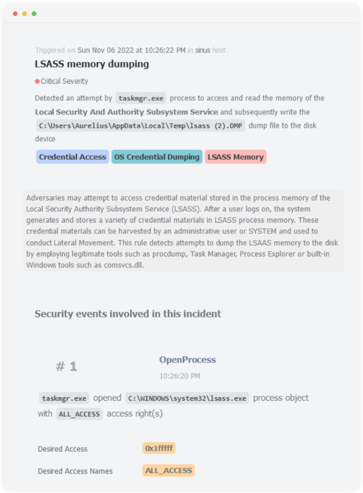

# Detection Rules

<p align="center" >
  <a href="https://www.fibratus.io" >
    
  </a>
</p>

This directory contains a catalog of detection rules modeled around the prominent [MITRE ATT&CK](https://attack.mitre.org/) framework. The goal is to provide a direct mapping of tactics, techniques, and sub-techniques for each rule. The following sections introduce the general structure, design guidelines, and best practices to keep in mind when creating new rules.

## Structure

Detection rules are organized in `yaml` files. Rules can live in different directories and there is no strict naming convention.
However, the recommended practice is to follow the `tactic_name_rule_name.yml` naming nomenclature. By default, all rules reside within
the `rules` directory of this repository.

The CLI provides a command to create a new rule from the template. For example, if you want to create the `Potential Process Doppelganging`
rule that belongs to the `Defense Evasion` MITRE tactic, you would use the following command.

```
$ fibratus rules create "Potential Process Doppelganging Injection" -t TA0005
```

The `-t` flag specifies the MITRE tactic id. The end result is the `defense_evasion_potential_process_doppelganging_injection.yml` file with the most
required attributes such as rule identifier, name, and the minimum engine version, filled out automatically.

## Guidelines

### Read the docs

This should be your starting point. Before trying to write new rules, explore the [docs](https://www.fibratus.io/#/filters/introduction) to learn about [filter expressions](https://www.fibratus.io/#/filters/filtering) fundamentals, [operators](https://www.fibratus.io/#/filters/operators), [functions](https://www.fibratus.io/#/filters/functions), [filter fields](https://www.fibratus.io/#/filters/fields) reference, and [rule engine](https://www.fibratus.io/#/filters/rules) specifics. 

### Stick to naming nomenclature

It is highly recommended to name the rule files after the pattern explained in the above section. This facilitates the organization and searching through the detection rules catalog and fosters standardization.

### Include descriptions and labels

Rules should have a meaningful description.
For example, `Potential process injection via tainted memory section`.

Additionally, there should exist labels attached to every rule describing the MITRE tactic, technique, and sub-technique. This information is used when rendering email rule alert templates as depicted in the image above.

### Rules should have a narrowed event scope

If a rule is declared without the scoped event conditions, you'll get a warning message in `Fibratus` logs informing you about unwanted side effects. **This always lead to the rule being utterly discarded by the engine!**

### Pay attention to the condition arrangement

As highlighted in the previous paragraph, all rules should have the event type condition. Additionally, condition arrangement may have important runtime performance impact because the rule engine can lazily evaluate binary expressions that comprise a rule. In general, costly evaluations or functions such as `get_reg_value` should go last to make sure they are evaluated after all other expressions have been visited.

### Prefer macros over raw conditions

Fibratus comes with a [macros](https://www.fibratus.io/#/filters/rules?id=macros) library to promote the reusability and modularization of rule conditions and lists. Before trying to spell out a raw rule condition, explore the library to check if there's already a macro you can pull into the rule. For example, detecting file accesses could be accomplished by declaring the `kevt.name = 'CreateFile' and file.operation = 'open'` expression. However, the macro library comes with the `open_file` macro that you can directly call in any rule. If you can't encounter a particular macro in the library, please consider creating it. Future detection engineers and rule writers could profit from those macros.

### Formatting styles

Pay attention to rule condition/action formatting style. If the rule consists of multiple or large expressions, it is desirable to split each spanning expression on a new line and properly indent the `and`, `or`, or `not` operators. By default, we use 1 space tab for indenting operators and rule actions. This notably improves readability and prevents formatting inconsistencies.
